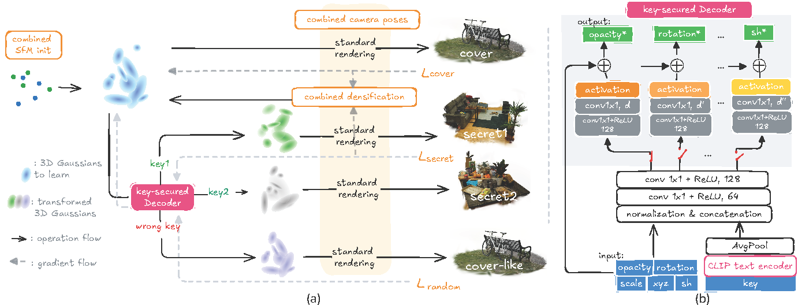

# All That Glitters Is Not Gold: Key-Secured 3D Secrets within 3D Gaussian Splatting
Yan Ren, Shilin Lu, Adams Wai-Kin Kong<br>
| [Full Paper](https://repo-sam.inria.fr/fungraph/3d-gaussian-splatting/3d_gaussian_splatting_high.pdf)|[Pre-trained Models (2.4 GB)](https://drive.google.com/file/d/1iZY-sOrWToP5GDfUISVcccJDkHipwrDO/view?usp=drive_link) |<br>


This repository contains the official authors implementation associated with the paper "All That Glitters Is Not Gold: Key-Secured 3D Secrets within 3D Gaussian Splatting". 


Abstract: *Recent advances in 3D Gaussian Splatting (3DGS) have revolutionized scene reconstruction, opening new possibilities for 3D steganography by hiding 3D secrets within 3D covers. The key challenge in steganography is ensuring imperceptibility while maintaining high-fidelity reconstruction. However, existing methods often suffer from detectability risks and utilize only suboptimal 3DGS features, limiting their full potential.
We propose a novel end-to-end key-secured 3D steganography framework (KeySS) that jointly optimizes a 3DGS model and a key-secured decoder for secret reconstruction. Our approach reveals that Gaussian features contribute unequally to secret hiding. The framework incorporates a key-controllable mechanism enabling multi-secret hiding and unauthorized access prevention, while systematically exploring optimal feature update to balance fidelity and security. To rigorously evaluate steganographic imperceptibility beyond conventional 2D metrics, we introduce 3D-Sinkhorn distance analysis, which quantifies distributional differences between original and steganographic Gaussian parameters in the representation space.
Extensive experiments demonstrate that our method achieves state-of-the-art performance in both cover and secret reconstruction while maintaining high security levels, advancing the field of 3D steganography.*


### Env Setup

First, follow the setup instructions for 3D Gaussian Splatting at https://repo-sam.inria.fr/fungraph/3d-gaussian-splatting/ to install the base dependencies and the datasets.

Then, install the additional dependencies for KeySS by running:
```shell
conda env create --file environment.yml
conda activate keyss
```

### Dataset and Output
The dataset needed consists of 9 scenes from MipNeRF360 dataset ([available here](https://jonbarron.info/mipnerf360/)) and 1 scene from Deep Blending dataset ([available here](https://repo-sam.inria.fr/fungraph/3d-gaussian-splatting/datasets/input/tandt_db.zip)). These scenes are used as cover and secret scenes in our experiments.
Please follow the dataset structure below to prepare the datasets and pretrained models in the source path location:

```
<location>
|---data
|   |---mipnerf360 #datasets
|     |---bicycle
|     |---...
|---output
    |---mipnerf360 #pretrained models
    |---single_secret
    |---multiple_secert
        
```


### Running

To train for single/multiple secret hiding, simply see the details in run_train.sh

```shell
bash run_train.sh
```

### Evaluation

To test for single/multiple secret hiding and 3D-Sinkhorn, simply see the details in run_test.sh

```shell
bash run_test.sh
```

## Acknowledgement
We would like to thank the authors of [3DGS](https://github.com/graphdeco-inria/gaussian-splatting) and [CLIP](https://github.com/openai/CLIP) for their great work and generously providing source codes, which inspired our work and helped us a lot in the implementation.


## Citation
If you find our work helpful, please consider citing:
```bibtex
@inproceedings{keyss2025,
  title={All That Glitters Is Not Gold: Key-Secured 3D Secrets within 3D Gaussian Splatting},
  author={Lin, Chenguo and Pan, Panwang and Yang, Bangbang and Li, Zeming and Mu, Yadong},
  author={Ren, Yan and Lu, Shilin and Kong, Adams Wai-Kin},
  journal={arXiv preprint arXiv:2503.07191},
  year={2025}
}
```


